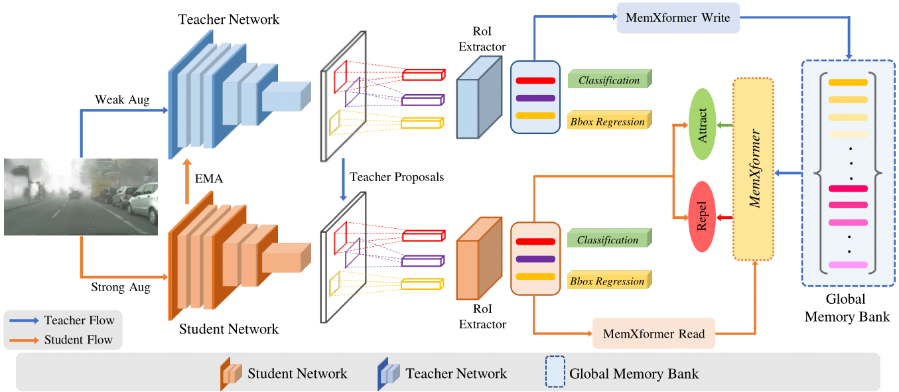

# Towards Online Domain Adaptive Object Detection [WACV 2023]

[](https://pytorch.org/) 

[Vibashan VS](https://vibashan.github.io/), [Poojan Oza](https://www.linkedin.com/in/poojan-oza-a7b68350/), [Vishal M Patel](https://scholar.google.com/citations?user=AkEXTbIAAAAJ&hl=en)

[[`Project Page`](https://viudomain.github.io/)] [[`WACV`](https://openaccess.thecvf.com/content/WACV2023/html/VS_Towards_Online_Domain_Adaptive_Object_Detection_WACV_2023_paper.html)] [[`pdf`](https://openaccess.thecvf.com/content/WACV2023/papers/VS_Towards_Online_Domain_Adaptive_Object_Detection_WACV_2023_paper.pdf)] [[`BibTeX`](https://github.com/Vibashan/online-da/blob/main/reference.bib)]

<p align="center">
  
</p>

#### Contributions
- To the best of our knowledge, this is the first work to consider both online and offline adaptation settings for detector models.
- We propose a novel unified adaptation framework which makes the detector models robust against online target distribution shifts
- We introduce the MemXformer module, which stores prototypical patterns of the target distribution and provides contrastive pairs to boost contrastive learning on the target domain.

## Contents
1. [Installation Instructions](#installation-instructions)
2. [Dataset Preparation](#dataset-preparation)
3. [Execution Instructions](#execution-instructions)
    - [Training](#training)
    - [Evaluation](#evaluation)
4. [Results](#results)
5. [Citation](#citation)

## Installation Instructions
- We use Python 3.6, PyTorch 1.9.0 (CUDA 10.2 build).
- We codebase is built on [Detectron](https://github.com/facebookresearch/detectron2).

```angular2
conda create -n online_da python=3.6

Conda activate online_da

conda install pytorch==1.9.0 torchvision==0.10.0 torchaudio==0.9.0 cudatoolkit=10.2 -c pytorch

cd online-da
pip install -r requirements.txt

## Make sure you have GCC and G++ version <=8.0
cd ..
python -m pip install -e online-da

```


## Dataset Preparation

* **PASCAL_VOC 07+12**: Please follow the instructions in [py-faster-rcnn](https://github.com/rbgirshick/py-faster-rcnn#beyond-the-demo-installation-for-training-and-testing-models) to prepare VOC datasets.
* **Clipart, WaterColor**: Dataset preparation instruction link [Cross Domain Detection ](https://github.com/naoto0804/cross-domain-detection/tree/master/datasets). Images translated by Cyclegan are available in the website.
* **Sim10k**: Website [Sim10k](https://fcav.engin.umich.edu/sim-dataset/)
* **CitysScape, FoggyCityscape**: Download website [Cityscape](https://www.cityscapes-dataset.com/), see dataset preparation code in [DA-Faster RCNN](https://github.com/tiancity-NJU/da-faster-rcnn-PyTorch)

Download all the dataset into "./dataset" folder.
The codes are written to fit for the format of PASCAL_VOC.
For example, the dataset [Sim10k](https://fcav.engin.umich.edu/sim-dataset/) is stored as follows.

```
$ cd ./dataset/Sim10k/VOC2012/
$ ls
Annotations  ImageSets  JPEGImages
$ cat ImageSets/Main/val.txt
3384827.jpg
3384828.jpg
3384829.jpg
.
.
```

## Execution Instructions

### Training

- Download the source-trained model weights in source_model folder [Link](https://drive.google.com/drive/folders/1Aia6wCHPCHGsVk8yQtuByxEyoYm1KfQq?usp=sharing)

```angular2
CUDA_VISIBLE_DEVICES=$GPU_ID python tools/train_onlineda_net.py \ 
--config-file configs/online_da/onda_foggy.yaml --model-dir ./source_model/cityscape_baseline/model_final.pth
```

### Evaluation

- After training, load the teacher model weights and perform evaluation using
```angular2
CUDA_VISIBLE_DEVICES=$GPU_ID python tools/plain_test_net.py --eval-only \ 
--config-file configs/online_da/foggy_baseline.yaml --model-dir $PATH TO CHECKPOINT
```

## Results

- Pre-trained models can be downloaded from [Link]([https://drive.google.com/drive/folders/1Aia6wCHPCHGsVk8yQtuByxEyoYm1KfQq?usp=sharing](https://drive.google.com/drive/folders/1ZhOy214K75y8fTCkTiYPMz06WbtZJeEM?usp=share_link).


## Citation

If you found Online DA useful in your research, please consider starring ⭐ us on GitHub and citing 📚 us in your research!

```bibtex
@inproceedings{vs2023towards,
  title={Towards Online Domain Adaptive Object Detection},
  author={VS, Vibashan and Oza, Poojan and Patel, Vishal M},
  booktitle={Proceedings of the IEEE/CVF Winter Conference on Applications of Computer Vision},
  pages={478--488},
  year={2023}
}
```

## Acknowledgement

We thank the developers and authors of [Detectron](https://github.com/facebookresearch/detectron2) for releasing their helpful codebases.
